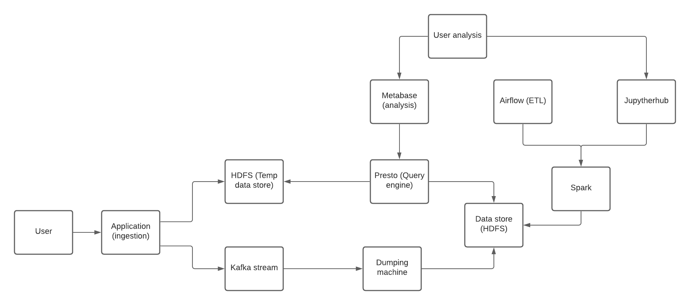

# Open Clickstream

**Projeto de cunho acadêmico científico**

## Problema

- Grande volume de dados
- Custos

## Motivação

- Aumento do fluxo e troca de informações
- Grande volume de dados
- Decisões de negócio
- Experiência personalizada para cada usuário
- Problemas de arquitetura no mundo de hoje
- Análise de informações em tempo real
- Plataformas de dados
- Tecnologias modernas
- Custos de plataformas robustas
- Soluções open-source

## Solução

Criar uma plataforma de dados com tecnologias preferencialmente open-source. Objetivo final é criar uma plataforma clickstream para análise de dados em tempo real para produtos de dados.

## Tecnologias

### Apache HBase

Data store não relacional, distribuído, orientado à coluna baseado na arquitetura BigTable da Google.

### Apache Presto / Trino

Ferramenta Query Engine para consulta em diferentes fontes de dados em uma única query.

### Apache Alluxio

Ferramenta para cacheamento de dados (redução significativa de custos).

### Apache Spark

Ferramenta para processamento massivo de dados em batch e stream.

### Apache Airflow

Ferramenta para gerenciamento de tarefas no sistema de DAGs (Direct Acyclic Graph).

### Apache Kafka

Ferramenta para stream de dados com alta disponibilidade, distribuído, tolerante a falhas.

### Apache Parquet

Formato colunar de armazenamento de dados.

## Arquitetura

