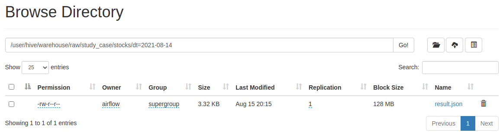
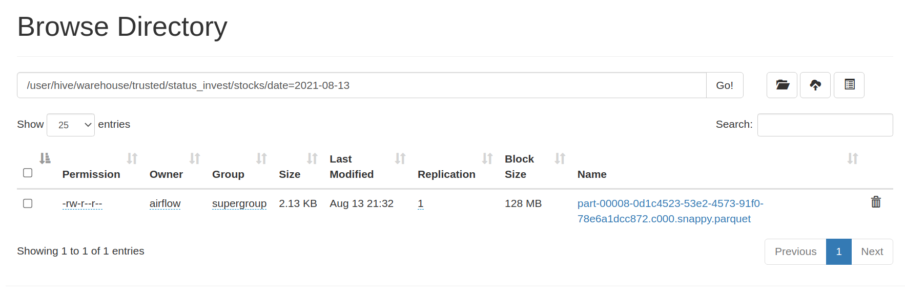
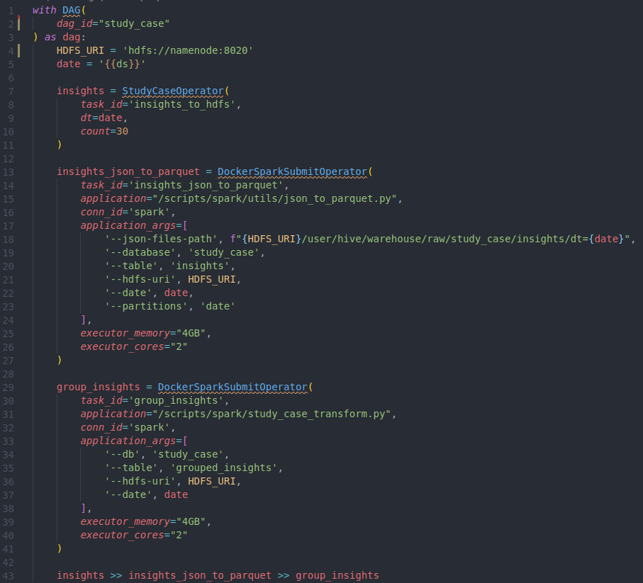
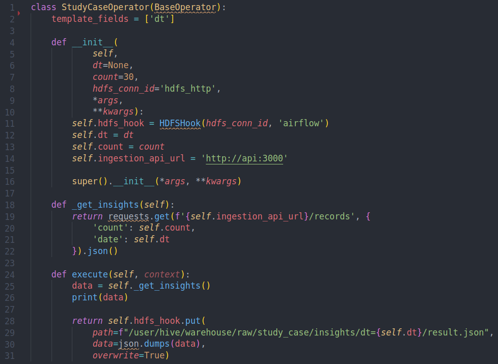
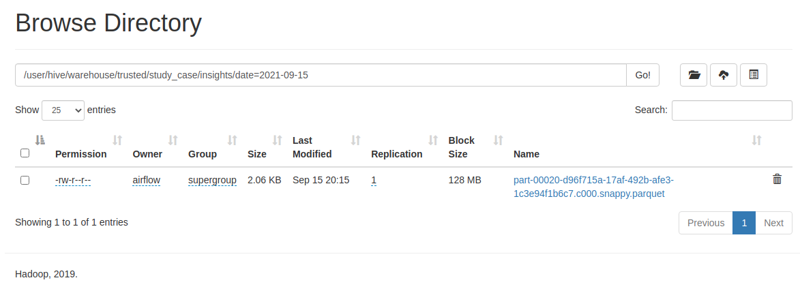
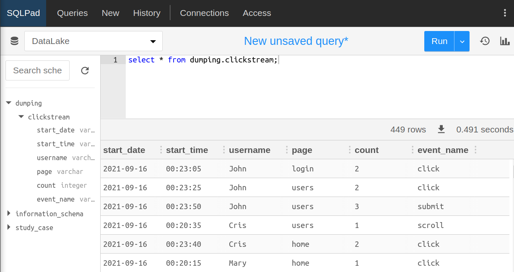

# Plataforma de Dados

- [1. Introdução](#1-introdução)
- [1.1. Objetivos do trabalho](#1-1-objetivos-do-trabalho)
- [2. Fundamentação técnica](#2-fundamentação-técnica)
  - [2.1 Plataforma de dados](#2-1-plataforma-de-dados)
  - [2.2 Data Lake](#2-2-data-lake)
  - [2.3 Big Data](#2-3-big-data)
  - [2.4 ETL](#2-4-etl)
  - [2.5 Apache Airflow](#2-5-apache-airflow)
  - [2.6 Apache Spark](#2-6-apache-spark)
  - [2.7 Hadoop Distributed File System](#2-7-hadoop-distributed-file-system)
  - [2.8 Apache Hive](#2-8-apache-hive)
  - [2.9 Event Streaming](#2-9-event-streaming)
  - [2.10 Apache Kafka](#2-10-apache-kafka)
  - [2.11 Trino](#2-11-trino)
  - [2.12 Apache Parquet](#2-12-apache-parquet)
  - [2.13 Apache Avro](#2-13-apache-avro)
  - [2.14 Confluent Schema Registry](#2-14-confluent-schema-registry)
  - [2.15 Computação distribuída](#2-15-computação-distribuída)
  - [2.16 Spark Structured Streaming](#2-16-Spark-Structured-Streaming)
  - [2.17 Docker](#2-17-docker)
  - [2.18 Plataforma Clickstream](#2-18-plataforma-clickstream)
- [3. Desenvolvimento](#3-desenvolvimento)
  - [3.1 Arquitetura](#3-1-arquitetura)
  - [3.2 Gerenciamento de pipelines com DAGs](#3-2-gerenciamento-de-pipelines-com-dags)
  - [3.3 Armazenamento de dados](#3-3-armazenamento-de-dados)
  - [3.4 Definição de metadados](#3-4-definição-de-metadados)
  - [3.5 Ingestão de dados em tempo real](#3-5-ingestão-de-dados-em-tempo-real)
  - [3.6 Análise dos dados](#3-6-análise-dos-dados)
  - [3.7 Estudo de casos](#3-7-estudo-de-casos)
  - [3.7.1 ETL em lote](#3-7-1-etl-em-lote)
  - [3.7.2 ETL em tempo real](#3-7-2-etl-em-tempo-real)
- [4. Resultados](#4-resultados)
- [5. Considerações finais](#5-considerações-finais)
- [5.1. Contribuições e Conclusões](#5-1-contribuições-e-conclusões)
- [5.2. Trabalhos futuros](#5-2-trabalhos-futuros)

## 1 Introdução

Nos dias atuais é cada vez mais comum empresas coletarem quantidades imensas de dados, que são gerados por usuários, ferramentas de auditoria que geram logs ou soluções que envolvem IoT. Porém, para lidar com essa quantidade imensa de dados não é uma tarefa trivial. Dependendo da área de negócio, dados devem ser armazenados em lugares de alta disponibilidade, consistente e seguro.

Além da preocupação em armazenar os dados, é entendível que estes servirão para algum
propósito, como por exemplo, entregar uma experiência personalizada para usuários, analisar e monitorar técnicas anti-fraude entre outras coisas. Neste momento que a área de processamento massivo de dados entra em questão.

O processamento de quantidades massivas de dados lida com alguns aspectos não tão triviais, por exemplo, alta capacidade computacional, computação distribuída e tolerante a falhas, o que caracteriza lidar com técnicas e ferramentas, conhecidas hoje como Big Data.

Hoje no mercado existem ferramentas e serviços disponíveis capazes de proporcionar ambientes auto-gerenciáveis que disponibilizam uma plataforma com alta disponibilidade, segura, normalmente tolerante a falhas entre outros aspectos. Porém, tais soluções envolvem altos custos de gerenciamento e suporte e, que também limitam a capacidade do usuário em extender ou personalizar uma solução, permitindo somente integrar ferramentas gerenciadas pela própria provedora do serviço ou plataforma.

### 1-1 Objetivos do trabalho

O objetivo geral deste trabalho é desenvolver uma plataforma de dados que proporcione a escrita de scripts capazes de extrair, transformar e armazenar dados aproveitando de ferramentas open-source disponibilizadas pelo mercado de teconlogia.

Para a realização deste trabalho foram estabelecidos alguns objetivos específicos que envolvem a criação de uma plataforma de dados:

- Utilizando ferramentas open-source
- Focada na otimização de custos
- Extensível e personalizável
- Que proporcione ao usuário a construção de produtos de dados
- Capaz de fazer análises históricas
- Capaz de coletar dados em tempo real
- Capaz de fazer processamentos de dados em lote e em tempo real

## 2 Fundamentação técnica

Neste capítulo serão abordados os conceitos básicos que definem uma plataforma de dados e seus requisitos, e também algumas das tecnologias que compõe a plataforma contruída neste trabalho.

### 2-1 Plataforma de dados

Plataforma de Dados é um conjunto ferramental e de técnicas que busca extrair dados de diversas fontes, alimentar e enriquecer tais dados, que por fim são armazenados em uma outra base de dados. A finalidade principal de uma plataforma de dados é centralizar os dados de uma organização, de modo que esteja em conformidade com leis de proteção de dados, aplicando inteligência para alavancar a sua estratégia.

Comumente, plataformas de dados incluem ferramentas de extração e transformação de dados que por fim são armazenados em tecnologias de armazenamento de dados em larga escala, conhecidos como Data Lake.

Referência: https://blog.tail.digital/o-que-e-customer-data-platform-e-porque-voce-precisa-de-um/

### 2-2 Data Lake

Data Lake é um tipo de repositório de dados que armazena quantidades massivas de dados estruturados e não estruturados. Comumente armazena-se dados brutos, ou dados não tratados, que no momento em que são coletados não há uma finalidade para tal, e sim, definida posteriormente. Este dado pode ser utilizado por cientístas e analístas de dados ou aplicações que envolvem aprendizado de máquinas por diversas vezes e para diversos propósitos, o que facilita a sua reutilização.

Algumas das principais diferenças entre Data Lake e Data Warehouse, que é outro tipo de ferramenta de armazenamento de dados para Big Data, é que Data Lakes armazenam dados não estruturados que são estruturados posteriormente (conhecido como "schema on read"). Também não são acomplados à ferramentas de alto custo computacional para otimização de leitura e controle de acesso concorrente à dados, o que minimiza gastos com hardware e software e flexibiliza a capacidade de armazenamento de dados.

Referência: https://www.redhat.com/en/topics/data-storage/what-is-a-data-lake

### 2-3 Big Data

Big Data refere-se à manipulação ou gerenciamento de uma larga quantidade de dados ou de dados muito complexos. Big Data tornou-se conhecido pelos "3 Vs" de variedade, velocidade e volume. Volume refere-se à quantidade massiva de dados, variedade à ampla gama de formatos não padronizados, volume refere-se à necessidade de processar com rapidez e eficiência.

O principal objetivo de Big Data é ofecer informações em tempo real que podem ser usadas para alavancar a estratégia da organização. O processamento de informações em tempo real é o principal objetivo das organizações que buscam agregar valor aos seus clientes de forma consistente e contínua, o que se encaixa em um dos pilares de computação de ponta.

Referência: https://www.redhat.com/en/topics/big-data

### 2-4 ETL

ETL, ou extrair (Extract), transformar (Transform) e armazenar (Load) é um processo que extrai, transforma e armazena dados de multiplas fontes para um data warehouse ou outro repositório unificado de dados.

No processo de extração, o dado é copiado de uma fonte e movido para outro local intermediário, conhecido como staging area. O dado pode ser extraído de um fonte de dados estruturado ou não estruturado, por exemplo, banco de dados transacionais SQL ou não SQL, sistemas ERP, e-mails, API REST e outros.

No processo de transformação o dado bruto pode, normalmente é, transformado em um formato útil que posteriomente é utilizado para análises. O processo de transformação pode envolver filtros, limpezas, duplicações, validações, cálculos, traduções, agregações, anonimizações para governança de dados entre outras coisas. Essa etapa de transformação normalmente ocorre em um ambiente computacional diferente da fonte, para assim, limitando o impacto do desempenho nos sistemas de origem e reduz a probabilidade de corrupção de dados.

No processo de armazenamento, o último passo, o dado é movido da staging area para um data warehouse, por exemplo. Normalmente, inicialmente envolve o armazenamento de todo o dado, seguindo por carregamentos de alterações de dados incrementais periodicos. Também pode haver a necessidade, menos comum, do reprocessamento do dados o que acaba envolvendo o carregamento total dos dados novamente.

Algumas ferramentas conhecidas na comunidade de engenharia de dados são Airflow, Luigi, Argo, Kubeflow e outros, aos quais abordam cada passo do processo ETL de forma separada.

Referência: https://www.ibm.com/cloud/learn/etl

### 2-5 Apache Airflow

Apache Airflow é uma plataforma open-source para criar, agendar e monitorar programaticamente fluxos de trabalho. Airflow é uma ferramenta principalmente utilizada para fluxos de trabalho ETL seguindo o conceito de DAGs (Directed Acyclic Graphs). Assim, as tarefas atribuídas ao fluxos são executadas por workers seguindo uma dependência especificada.

A ferramenta Airflow permite a integração com diversas outras ferramentas que auxiliam no processo de ETL, como por exemplo, Apache Spark para transformação de dados de forma distribuída.

Referência: https://airflow.apache.org/docs/apache-airflow/stable/index.html

### 2-6 Apache Spark

Apache Spark é um mecanismo de análise unificado para processamento de dados em grande escala. Spark utiliza caching em memória, a grande diferença do seu concorrente Hadoop, e execução de consulta otimizada para consultas rápidas em dados de qualquer tamanho. Alguns componentes disponibilizados pelo Spark, como por exemplo Spark Streaming e Spark Core, possibilitam processamento de dados em lotes e stream.

Referência: http://spark.apache.org/

### 2-7 Hadoop Distributed File System

HDFS é um sistema de arquivos distribuído que lida com grandes conjuntos de dados executados em hardware comum. Ele é usado para dimensionar um único cluster Apache Hadoop para centenas(e até milhares) de nós. HDFS é um dos principais componentes do Apache Hadoop.

Com HDFS os dados podem ser particionados e armazenados em diferentes nós/servidores. O particionamento em diversos nós gera a replicação de dados, o que implica na redundância também. A redundância pode ser aumentada ou diminuída, conforme o caso de uso da aplicação. Portanto a redundância oferece múltiplos benefícios, o mais óbvio é a alta disponibilidade - um dos principais pilares de computação distribuída.

Referência: https://www.ibm.com/analytics/hadoop/hdfs

### 2-8 Apache Hive

Apache Hive é uma ferramenta de data warehouse que facilita a leitura, escrita e gerenciamento de grandes conjuntos de dados que residem em armazenamento distribuído e consultados usando a sintaxe SQL.

Hive disponibiliza algumas ferramentas como:

- Acesso a dados via instruções SQL, portanto permite tarefas de extração, transformação e armazenamento
- Mecanismo de armazenamento de dados estruturados em uma variedade de formatos
- Acesso à arquivos armazenados diretamente no Apache HDFS ou HBase
- Execução de consultas via Apache Spark ou MapReduce
- Componente para armazenamento de metadados, ou descritores de arquivos

Apache Hive foi projetado para maximizar a escalabilidade (escalar horizontalmente com mais máquinas adicionadas dinamicamente ao cluster Hadoop), desempenho, extensibilidade, tolerância a falhas e acoplamento fraco com seus formatos de entrada.

Referência: https://cwiki.apache.org/confluence/display/Hive/Home

### 2-9 Event Streaming

O event streaming é a prática de capturar dados em tempo real de fontes de eventos como bancos de dados, sensores, dispositivos móveis, serviços em nuvem e aplicativos de software na forma de fluxos de eventos; armazenar esses fluxos de eventos de forma duradoura para recuperação posterior; manipular, processar e reagir aos fluxos de eventos em tempo real e também retrospectivamente; e encaminhar os fluxos de eventos para diferentes tecnologias de destino, conforme necessário. O streaming de eventos, portanto, garante um fluxo contínuo e interpretação dos dados para que as informações certas estejam no lugar certo, na hora certa.

Algumas das principais ferramentas de event streaming no mercado nos dias de hoje são Apache Kafka, AWS Kinesis, ActiveMQ, RabbitMQ entre outros.

Referência: https://kafka.apache.org/documentation/

### 2-10 Apache Kafka

Apache Kafka é uma plataforma de streaming de eventos distribuídos de código aberto usada por milhares de empresas para pipelines de dados de alto desempenho, análise de streaming, integração de dados e aplicativos de missão crítica.

Kafka é comumente utilizado no processo ETL na etapa de extração via transmissão de eventos de diversas fontes para uma área intermediária, conhecida como staging area.

Referência: https://kafka.apache.org/

### 2-11 Trino

Trino é um mecanismo de consulta SQL distribuído projetado para consultar grandes conjuntos de dados distribuídos em uma ou mais fontes de dados heterogêneas. Trino é utilizado principalmente para trabalhar com terabytes or petabytes de dados armazenados em fontes diversas, como por exemplo, Apache HDFS, bancos de dados transacionais como MySQL, Oracle e também outras fontes de dados como Cassandra.

Trino foi projetado para manipular análises e data warehousing: análises de dados, agregrações de quantidades massivas de dados. Essas cargas de trabalho são sempre classificadas como Online Analytical Processing (OLAP).

Referências:

- https://trino.io/docs/current/overview.html
- https://trino.io/docs/current/overview/use-cases.html

### 2-12 Apache Parquet

Apache Parquet é um formato de armazenamento colunar disponível no ecossistema Hadoop, independentemente da escolha da estrutura de processamento de dados, modelo de dados ou linguagem de programação.

Apache Parquet permite armazenar arquivos contendo a definição do schema no próprio arquivo com alguns metadados. Além disso, é possível armazenar a declaração do particionamento de dados. Com o benefício de armazenamento colunar do Apache Parquet, os custos de armazenamento, leitura e processamentto dos dados reduzem significativamente, pois os dados são compactados e a leitura é feita apenas nas colunas necessárias para retornar uma consulta.

A figura abaixo ilustra a comparação na leitura de 1 TB de dados em um arquivo CSV e no formato Parquet.

Referências:

- https://parquet.apache.org/
- https://blog.openbridge.com/how-to-be-a-hero-with-powerful-parquet-google-and-amazon-f2ae0f35ee04

### 2-13 Apache Avro

Apache Avro é formato binário de armazenameno de arquivos e mensagens. Apache Avro resolves alguns dos principais problemas quando trata-se de evolução de schemas de dados estruturados. Avro armazena no próprio arquivo ou mensagem a definição dos schemas, então aplicações antigas conseguem ler schemas novos e, aplicações novas conseguem ler schemas antigos. Além disso Avro é armazenado em formato binário, o que o torna compacto e eficiente.

Referências:

- https://www.ibm.com/analytics/hadoop/avro
- https://catherine-shen.medium.com/why-you-should-use-avro-and-schema-registry-for-your-streaming-application-2f24dcf017c8

### 2-14 Confluent Schema Registry

Confluent Schema Registry é uma camada provedora de metadados. Disponibiliza uma API RESTFul para armazenar a definição de schemas no formato Avro, JSON ou Protobuf. Com Schema Registry torna-se capaz armazenar versões de cada schema, o que permite visualizar o histórico de versões dos schemas. Atua como um componente intermediário separado dos brokers do Apache Kafka, porém permite a comunicação com consumers para recuperar schemas e assim fazer a leitura de tópicos, como também se comunica com producers para validarem schemas e postarem mensagens em tópicos.

Referências:

- https://docs.confluent.io/platform/current/schema-registry/index.html

### 2-15 Computação distribuída

Computação distribuída é termo para referir-se a sistemas que possuem múltiplos componentes de softwares executando em múltiplos computadores, mas executando apenas um sistema. Sistemas distribuídos podem constituir-se de múltiplos computadores localizados geograficamente no mesmo local conectados por uma rede local ou podem estar geograficamente distribuídos conectados por um rede ampla. O objetivo da computação distribuída é fazer com que esse múltiplos computadores se comportem como apenas um. Alguns benefícios da computação distribuída inclue escalabilidade, podendo adicionar mais computadores a rede e também a redundância, ao qual se um computador parar de funcionar, o sistema continuará executando.

Referências:

- https://www.ibm.com/docs/ko/txseries/8.1.0?topic=overview-what-is-distributed-computing

### 2-16 Spark Structured Streaming

Spark Structured Streaming é um mecanismo de processamento em tempo real que utiliza Spark SQL para criar fluxos de processamento de dados da mesma maneira que fluxo de processamento em lote são criados. Spark Structured Streaming é responsável por adicionar todos os dados em um fluxo de streaming e adicionar ao final de uma DataFrame ou Dataset, que é componente do mecanismo Spark SQL.

Referências:

- https://spark.apache.org/docs/latest/structured-streaming-programming-guide.html

### 2-17 Docker

Docker é uma plataforma open-source que permite desenvolvedores virtualizar componentes e aplicações utilizando a técnica de containers e imagens. Docker permite empacotar diversas aplicações e suas respectivas configurações em um único artefato - a imagem, ao qual pode ser implantada e replicada diversas vezes minimizando o custo de manutenção.

Referências:

- https://docs.docker.com/get-started/overview/

### 2-18 Plataforma Clickstream

Plataforma Clickstream, ou software de Clickstream é um produto que coleta todo o fluxo da jornada online de usuários em uma plataforma ou websiite. Normalmente plataformas de Clickstream são focados em um único website e geralmente mostram o progresso dos usuários desde o momento em que ingressam no website até o momento que fecham a compra de um produto. Dados gerados por esse tipo de plataforma são comumente utilizados para análise do comportamento de usuários.

Referências:

- https://www.wordtracker.com/blog/keyword-research/what-is-clickstream-data

## 3 Desenvolvimento

Este capítulo aborda o processo de construção e desenvolvimento da plataforma de dados, tanto quanto o de definição da arquitetura da plataforma.

### 3-1 Arquitetura

A figura X mostra a arquitetura ao qual a plataforma de dados foi implementada. Na arquitetura, destaca-se 4 camadas - Airflow juntamente com Spark definindo a camada de processamento, ou seja, onde ocorre o gerenciamento de pipelines ETL em lote. Hadoop (HDFS) e Hive Metastore como camada de armazenamento ou Data Lake, tanto os dados/informações em sí, como também o catalogo de dados. Trino compõe a camada de análise, ao qual é possível executar instruções utilizando-se da síntaxe SQL para a exploração analítica dos dados. Por fim, a aplicação escrita em Javascript (Node.js), Apache Kafka e Spark Streaming compõem a camada de ingestão e processamento de dados em tempo real.

### 3-2 Gerenciamento de pipelines com DAGs

Para definir, executar e gerenciar tarefas previamente agendadas utilizou-se a ferramenta Apache Airflow. Tal ferramenta permite-nos escrever diferentes scripts na linguagem Python que denominam-se tarefas. Um conjunto de tarefas compõem o que chama-se na literatura de pipelines ETL, as DAGs. As DAGs permite-nos definir fluxos de execução complexos, não limitando-se apenas a execução de códigos locais, mas também a invocação de aplicação remotas e também a chamada de APIs externas entre outros tipos de soluções.

A figura X mostra a definição de uma DAG simples, ao qual a primeira tarefa é uma função Python que recebe dois números e retorna a soma deles. A segunda tarefa é outra função Python que apenas mostra o texto `ok` e retorna o mesmo.

A figura X mostra de forma visual como as tarefas anteriormente definidas formam um grafo acíclico direcionado.

### 3-3 Armazenamento de dados

Para compor e alimentar o Data Lake, utilizou-se a ferramenta Apache Hadoop (HDFS). Para a inserção de dados no HDFS via tarefas definidas no Airflow, fez-se necessário a criação de um Hook - um script personalizado que se comunica internamente com uma API do HDFS. A figura X representa a definição do código Hook para a comunicação com a API do HDFS.

Por fim, para inserir os dados no HDFS fez-se necessário apenas invocar o Hook e passar quais dados a serem inseridos. A figura X demonstra o exemplo da invocação do hook e a inserção de um dado no formato JSON e a figura X mostra o dado já persistido no HDFS.

O pilar de distribuição de dados se dá pela forma ao qual o HDFS é implementado. A arquitetura é definida por dois componentes, sendo eles Namenode e Datanode.

Namenode caracteriza-se pela interface com o cliente ao qual quer manipular os dados e comporta-se como um orquestrador. Tal componente responsabiliza-se por receber as chamadas de leitura e escrita de dados e decidir em qual nó (Datanode) o dado será persistido ou será consultado para disponibilização. Namenode armazena somente metadados, como por exemplo, nomo e caminho de arquivos, número de blocos escritos, número de réplicas e outras informações relacionadas aos Datanodes.

Datanodes, como citado anteriormente, são orquestrados pelo Namenode, e sua função é persistir e disponibilizar bloco de dados ao qual é requisitado pelo Namenode. A figura X ilustra a arquitetura do HDFS.

### 3-4 Definição de metadados

Para a estruturação e definição dos dados, ou seja, definição de databases, tabelas e suas respectivas colunas fez-se necessário a utilização da ferramenta Apache Hive juntamente com Apache Spark para a definição de scripts que recebem um caminho de arquivo em um formato conhecido, como por exemplo JSON, e o converte para outro formato conhecido, Apache Parquet, para posterior consulta via uma ferramenta de análise de dados.

A figura X mostra um trecho de código que recebe o caminho de um arquivo no formato JSON e o persiste novamente em outro caminho no formato Parquet. O script não somente persiste o dado em outro formato, mas também cria os metadados de definição do dados, como por exemplo, a estrutura da tabela. A criação dos metadados é feita internamente pela API do Apache Spark. As figuras X e X mostram respectivamente o dado persistido no HDFS e a definição da tabela criada.

### 3-5 Ingestão de dados em tempo real

Uma plataforma de dados ao qual se faz processamento de dados em tempo real necessita de uma ponta ou camada para ingestão de dados em tempo real. Para prover a capacidade de ingerir dados em tempo real, criou-se uma aplicação escrita em Javascript utilizando-se a plataforma Node.js para prover uma API HTTP ao qual se passa o titulo da mensagem e o dado da mensagem no corpo da requisição HTTP.

A figura X apresenta a classe Javascript implementada para receber o titulo da mensagem, que condiz com o nome do tópico Kafka ao qual a mensagem será postada, e também o corpo da mensagem. É importante notar que, antes da postagem da mensagem no tópico Kafka é feito a codificação da mensagem para um formato conhecido, Apache Avro. Internamente, após a codificação da mensagem também é validado se o esquema da mensagem é um esquema válido registrado no repositório de esquemas, o então Confluent Schema Registry. Só então a mensagem é de fato postada no Kafka.

### 3-6 Análise dos dados

Com o intuito de disponibilizar aos usuários a possibilidade de consultar os dados persistidos no Data Lake usando uma síntaxe conhecida, como por exemplo SQL, usou-se o componente Trino.

Para disponibilizar o ambiente provido do componente Trino, usou-se a ferramenta Docker para subir um container com a imagem do Trino e um arquivo de configuração para expor os dados armazenados como um catálogo de dados. A figura X e X, respectivamente demonstram a configuração do ambiente com Trino e do catálogo de dados.

Por fim, para disponibilizar uma interface intuitiva para o usuário realizar consultas SQL, usou-se o componente SQL Pad ao qual interage com o catálogo de dados definido no Trino.

Para disponibilizar o ambiente provido do componente SQL Pad, também usou-se a ferramenta Docker para subir um container com a imagem contendo o SQL Pad. A figura X e X mostram respectivamente a definição do container do SQL e por fim o uso para realizar consultas SQL.

### 3-7 Estudo de casos

Nesta subseção serão apresentados estudo de casos envolvendo fluxos ETL em lote, tanto quanto, em tempo real.

### 3-7-1 ETL em lote

Como demonstração de um fluxo ETL em lote de ponta-a-ponta, implementou-se um fluxo completo de extração, transformação e persistência utilizando uma API escrita na linguagem Javascript, os scripts de extração e transformação com a biblioteca PySpark.

Com o objetivo de expor dados para extração, criou-se uma API ao qual gera um conjunto de dados aleatórios simulando um evento de clique, visualização ou submissão de um formulário por parte de um usuário.

A Figura X apresenta o código de implementação da API geradora de dados aleatórios, ao qual na chamada da API é passado o parâmetro nomeado como `date` e um limitador da quantidade de registros por chamada, nomeado como `count`.

Da linha 28 a 35 implementou-se o método responsável por gerar um objeto JavaScript contendo os campos username, page e event_name com valores aleatórios. O campo event_time é a conversão do parâmetro date para o formato de Timestamp.

Da linha 19 a 26 foi implementado o método responsável por gerar N objetos JavaScript utilizando o método anteriormente citado, onde N corresponde ao parâmetro count. Por fim, o método envia uma resposta de volta ao cliente invocador da API HTTP.

Para realizar a extração dos dados da API anteriormente citada, criou-se um script de DAG contendo 3 tarefas para definição do fluxo ETL. A Figura X apresenta a implementação do script.

Da linha 7 a 11 é definida a primeira tarefa nomeada como `insights_to_hdfs`. Na primera tarefa é utilizado um operador personalizado - StudyCaseOperator, responsável por fazer uma chamada a API geradora de dados aleatórios e persistir a resposta da chamada no Data Lake. É importante ressaltar que os dados da resposta são persistidos em uma camada de dados brutos, sem nenhuma transformação.

A segunda tarefa, implementada da linha 13 a 27 nomeada como insights_json_to_parquet, é responsável por transformar o dado bruto extraído da API no formato JSON para o formato colunar Parquet, como também a criação de uma tabela no catálogo de dados do Hive Metastore. Nessa tarefa é utilizada outro operador personalizado, responsável por submeter a execução de scripts para o cluster Spark.

A terceira e última tarefa, nomeada como group_insights definida da linha 29 a 41 é responsável por realizar transformações no dado já catalogado, aplicando transformações com intuito de extrair informações analíticas. Essa tarefa também utiliza o mesmo operador da tarefa anterior, que faz submissão de scripts para o cluster Spark. Na Figura X é apresentado a implementação do script de transformação.

Na linha 4 a 8 é implementado o código para receber como argumentos a data ao qual o script irá extrair os dados.

Na linha 10 a 26 do script é iniciado uma instância da aplicação Spark como também a instrução SQL que aplica as transformações nos dados. Com intuito de simular a obtenção de alguma informação analítica do dado. O script aplica uma agregação dos dados de uma determinada data, especificada pelo cláusula `WHERE date = '%s'`. Agrupa pelo campo event_name e faz a contagem de cada tipo de evento.

Por fim, na linha 28 a 36 a instrução é de fato executada, e o resultado da transformação é persistido no Data Lake, porém em outra camada - de dados analíticos.

A Figura X apresenta a implementação da classe operador personalizado anteriormente citado, nomeado como StudyCaseOperator.

Na linha 4 a 16 é definido o construtor da classe operadora, ao qual são definidas variáveis iniciais contendo a data de execução do script, o contador de objetos e o endereço da API geradora de dados aleatórios.

Na linha 18 a 22 é definido o conjunto de códigos que realiza a chamada HTTP à API geradora de dados, passando como parâmetro a data e o contador de objetos definidos no construtor da classe. É utilizado o pacote requests nativo do Python.

Para a definição do código executor da classe operadora, na linha 24 a 31 é implementado o método execute que realiza a chamada HTTP a API e persiste o resultado da chamada no formato JSON na camada de dados brutos do HDFS.

Na Figura X é apresentado o script de transformação de dados no formato JSON para o formato Parquet, citado anteriormente na definição da segunda tarefa ETL.

Na linha 1 a 17 são definidas as variáveis contendo o caminho do arquivo JSON, o nome do banco de dados e tabela onde o dado Parquet será persistido, a data de execução do script e a instância da aplicação Spark.

Na linha 19 a 22 é iniciado a leitura do arquivo JSON, como também a adição de uma nova coluna contendo a data de execução do script, anteriormente definida. A partir da linha 23 a 30 é iniciado a persistência dos novos arquivos no formato Parquet, como também a especificação do nome do banco de dados, tabela e o caminho de onde os arquivos serão persistidos. Por fim, na linha 32 a aplicação Spark é finalizada.

### 3-7-2 ETL em tempo real

Como demonstração de um fluxo ETL em tempo real de ponta-a-ponta, implementou-se um fluxo de Clickstream utilizando a biblioteca PySpark. O objetivo do experimento foi enviar dados aleatórios para uma API HTTP, implementada na seção 3.5. A partir da API, os dados foram postados em um tópico Kafka ao qual, conectou-se uma aplicação Clickstream para receber os eventos e agrupa-los em uma janela de tempo definida de 5 segundos. A cada janela de tempo, os eventos foram agrupados e por fim contabilizado a quantidade de eventos de cada usuário na respectiva janela de tempo.

A seguir as Figuras X e Y apresentam o código da aplicação Clickstream separado em duas partes. O código da aplicação foi implementado utilizando a biblioteca PySpark juntamente com o framework Spark Structured Streaming.

Na Figura X ao qual apresenta a primeira parte da aplicação, no trecho de código da linha 5 a 13 é definido a estrutura dos dados que são transmitidos no tópico Kafka utilizando a síntaxe de definição do formato Avro. Da linha 18 a 22 é instanciado a aplicação Spark que será executada. Da linha 24 a 30 é instanciado um objeto DataStreamReader ao qual são lidos e processados cada evento que é transmitido no tópico Kafka especificado na linha 29.

Na Figura X, no trecho de código apresentado da linha 32 a 40 é aplicado algumas transformações no evento recebido pelo DataStreamReader. Na linha 33 é removido caracteres mágicos e extraído a mensagem Avro convertida para JSON. Da linha 35 a 40 cada campo do objeto JSON é anexado a sua respectiva coluna contendo o nome do campo.

No trecho de código da linha 41 a 47 é aplicado a função de janelamento, onde cada janela contém eventos dentro de um período de 5 segundos. Tais eventos são agrupados pelas colunas event_name, page e username que por fim, é aplicado uma contagem da quantidade de eventos de cada grupo adicionando-se o campo start_date e start_time contendo respectivamente o ano-mês-dia e hora-minuto-segundo da janela.

Por fim, da linha 49 a 56 é criado uma instância do objeto DataStreamWriter, ao qual os dados processados anteriormente são preparados para serem persistidos no Data Lake, no formato Parquet e no caminho de arquivo especificado na linha 53.

Para a definição e criação da estrutura de dados dos eventos postados no tópico Kafka anteriormente citado, foi-se necessário criar um script capaz de criar a estrutura do dado no repositório de esquemas - Schema Registry. Na Figura X é apresentado o script de criação de esquemas no formato Avro.

No trecho de código da linha 5 a 23, é definido a estrutura do dado e o corpo da requisição de criação de esquema a ser enviado para a API do Schema Registry. Da linha 27 a 33 é realizado a chamada criação de esquema a API, passando como corpo da requisição a estrutura definida anteriormente.

Para fazer a postagem dos eventos na API HTTP citada na seção 3.5 utilizando o formato do dado anteriormente definido, criou-se um script apresentado na Figura X.

No trecho de código da linha 7 a 9 são definidos conjuntos de dados a serem sorteados por um número aleatório. Da linha 11 a 16 é definido o modelo do corpo da requisição a ser enviado a API citada na seção 3.5. Da linha 18 a 36 é definido um loop infinito, onde são sorteados aleatoriamente os dados anteriormente definidos. Com os dados sorteados, os campos do modelo do corpo da requisição são preenchidos e por fim, é feito a postagem da mensagem a API.

## 4 Resultados

Neste capítulo serão apresentados os resultados do desenvolvimento de uma plataforma para extração, transformação e disponibilização de dados dos estudo de casos anteriormente apresentados.

### 4-1 ETL em lote

Nesta seção serão apresentados os resultados obtidos a partir da criação de um fluxo ETL em lote implementado na seção 3.7.1.

A Figura X apresenta uma chamada HTTP feita na API geradora de dados aleatórios através do navegador. Na chamada são passados os parâmetros de data (date) e quantidade de objetos (count). A resposta retorna os dados necessários para realizar as transformações posteriores.

Na Figura X é apresentado a representação gráfica da DAG no Airflow implementada na seção 3.7.1. Na figura é possível visualizar a 3 tarefas que compõem o fluxo ETL e também que todas as tarefas foram executadas com sucesso, representado pela borda na cor verde como também o marcador success.

Na Figura X é apresentado a aplicação web do Spark, ao qual é possível visualizar o histórico de aplicações Spark executadas submetidas a partir das tarefas no Airflow.

Nas Figura X e X são apresentados os dados persistidos pela primeira tarefa da DAG - a tarefa de extração de dados. É possível observar que os dados são particionados pela data em que a tarefa foi executada.

Na Figura X é apresentado os dados persistidos pela tarefa de transformação do dado bruto para o formato Parquet. É possível observar que os dados estão persistidos em outra camada, nomeada como trusted e também que o caminho do arquivo leva o nome da tabela Hive que foi criada.

Na Figura X é apresentado os dados de resultado persistidos a partir da execução da terceira tarefa. Na figura é possível observar que os dados são persistidos na mesma camada trusted, porém em outro caminho de arquivo ao qual leva o nome da tabela Hive que foi criada.

Na Figura X e X são apresentados respectivamente instruções SQLs para consultar os dados persistidos nas tabelas criadas pela segunda e terceira tarefa. As tabelas levam o nome de insights e grouped_insights, ao qual a insights contém apenas os dados convertidos do formato JSON para Parquet. A tabela grouped_insights contém os dados agrupados pelos campos anteriormente citados na seção 3.7.1. As consultas foram feitas através da ferramenta SQL Pad.

### 4-2 ETL em tempo real (Clickstream)

Nesta seção serão apresentados os resultados obtidos a partir da criação de um fluxo ETL em tempo real implementado na seção 3.7.2, nomeada como Clickstream.

Na Figura X é apresentado a execução do script para criação do esquema no formato Avro dos eventos que são postados na API apresentada anteriormente na seção 3.5. Na figura é possível observar que o corpo completo do esquema é mostrado como saída da execução do script como também os identificadores no repositório de esquemas. O esquema criado foi nomeado como appclickstream.

Na Figura X é apresentado a execução do script que realiza chamadas HTTP na API anteriormente citada para a postagem dos eventos no respectivo tópico Kafka. O script foi invocado passando como parâmetro o nome do esquema criado anteriormente e, como segundo parâmetro um número indicando o tempo de espera entre cada chamada a API. O script realiza infinitas chamadas, mas para fins de testes a execução foi interrompida.

A partir das postagens realizadas na API HTTP consequentemente no tópico Kafka, a aplicação Spark Structured Streaming passa a realizar o processamento dos eventos que são entregues pelo tópico Kafka. A Figura X e X apresentam algumas métricas fornecidas pelo próprio Spark, como por exemplo, o número de eventos e linhas processadas, a duração de cada registro processado etc.

A Figura X e X apresentam respectivamente o dados processados e persistidos pela aplicação Clickstream no Data Lake e a tabela Hive ao qual é possível consultar tais dados.

## 5 Considerações finais

### 5-1 Contribuições e Conclusões

Citar contribuições de decisões técnicas aplicadas no time na atual empresa ao qual eu atuo

### 5-2 Trabalhos futuros

Este trabalho não encerra as pesquisas no desenvolvimento de uma plataforma para extração, transformação e disponibilização de dados em tempo real e lote, mas abre a oportunidade para os seguintes trabalhos futuros:

- Aplicar práticas para atingir o estado-da-arte (camadas do data lake)
- Utilizar ferramenta para gerenciamento de acessos - Apache Ranger
- Utilizar ferramenta que atenda requisitos de latencia no processamento em tempo real - Apache Flink
